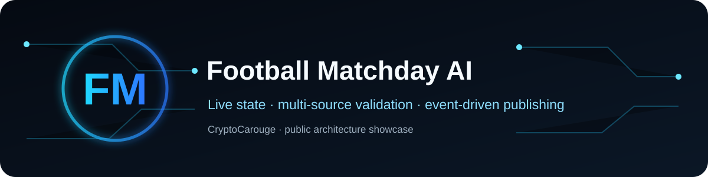
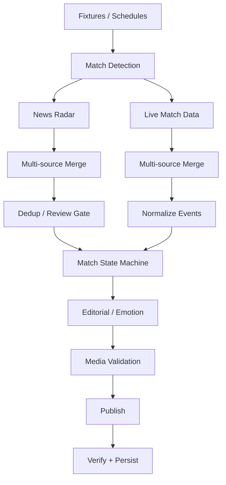

# Football Matchday AI Agent

An event-driven football intelligence and publishing system built with n8n.

The private project was created around matchday automation for a football fan account. The public version focuses on the reusable engineering: live-state handling, multi-source validation, deduplication, editorial generation and publication control.

> **Engineering case study:** [architecture decisions, failure modes and privacy boundary](docs/case-study.md)

## What it demonstrates

- Fixture discovery across competitions
- Matchday scheduling and live polling
- Multi-source live-event normalization
- Persistent match-state machine
- Event deduplication
- News radar and source merging
- Editorial review gates
- Context-aware reaction generation
- Media selection and validation
- X publishing and Telegram review/control
- Health checks for external data sources

## Architecture

## Why a state machine matters

A live match is not just a stream of isolated events. Persistent state lets goals, score changes, match phases and previously handled events influence what happens next without reposting the same event.

## Security boundary

The public repository excludes OpenAI keys, X OAuth credentials, Telegram credentials/chat IDs, account-specific prompts, private publishing controls and production workflow JSON.

## Disclaimer

Independent fan-automation engineering project. Not affiliated with FC Porto, any football club, league, broadcaster or sports-data provider.
